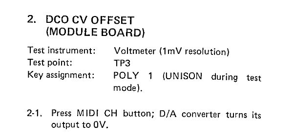
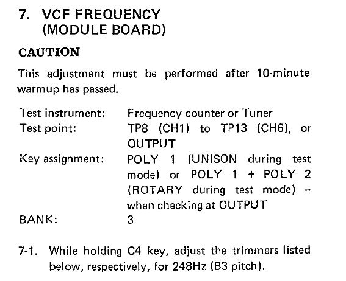
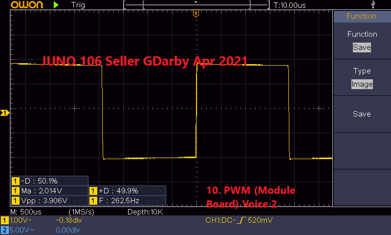

# Roland Juno 106 - Serial number 

[TOC]

# Notes

1. All voice chips replaced with new Analogue Renaissance alternatives - At least 2 of the original voice chips were faulty.
2. All wave generator chips replaced with new Analogue Renaissance alternatives - The originals seemed ok.
3. Bender assembly restored - Broken plastics repaired, all faders & pots fully stripped/cleaned/lubed.
4. New BelltoneSynthWorks US fader & switch dust gaskets throughout. 
5. Restored panel board white & blue button colour.
6. All 34 panel board tact switches replaced - I chose stiffer switches than standard for a more tactile feel.
7. All faders fully stripped/cleaned & lubed.
8. Power supply refresh - Replaced large caps with new high quality caps, freshly re-soldered all regulators & fully calibrated.
9. Keyboard - Fully cleaned keys and all contacts.
10. Front panel cleaned cleaned and sticker residue removed.
11. Missing fader caps replaced with originals.
12. Memory battery removed from CPU board to prevent risk of damage. Swapped to a user replaceable CR123 (not that it will EVER need replacing)
13. Full service inline with original Roland service manual.

# Restoration Album

https://photos.app.goo.gl/bYYfmSNdXnMoHRXN6

# Calibration

## DC Supply Voltages (Power Supply Board)

**Test Point A**

**Test Point B**

**Test Point C**

**Test Point D**

## DCO CV Offset (Module Board)

## VCA Bias (Module Board)

## VCA Offset

**Example Voice 1 before calibration**

**Voice 1**

**Voice 2**

**Voice 3**

**Voice 4**

**Voice 5**

**Voice 6**

## VCF Resonance (Module Board)

**Voice 1**

**Voice 2**

**Voice 3**

**Voice 4**

**Voice 5**

**Voice 6**

## VCA Gain (Module Board)

**Voice 1**

**Voice 2**

**Voice 3**

**Voice 4**

**Voice 5**

**Voice 6**

## VCF Frequency (Module Board)

**Voice 1**

**Voice 2**

**Voice 3**

**Voice 4**

**Voice 5**

**Voice 6**

## VCA Width (Module Board)

**Voice 1**

**Voice 2**

**Voice 3**

**Voice 4**

**Voice 5**

**Voice 6**

## Noise Level (Module Board)

## PWM (Module Board)

**Voice 1**

**Voice 2**

**Voice 3**

**Voice 4**

**Voice 5**

**Voice 6**

## Chorus Bias (Jack Board)

## Load Offset (Jack Board)

